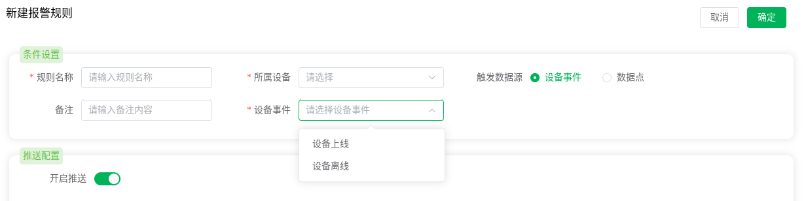
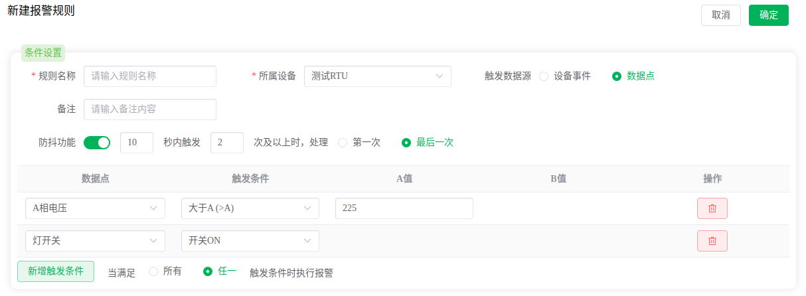
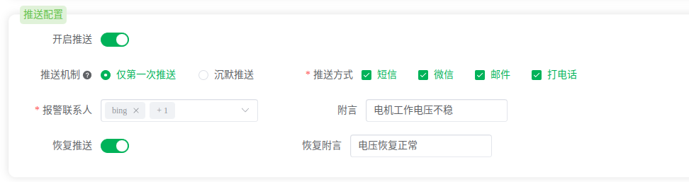
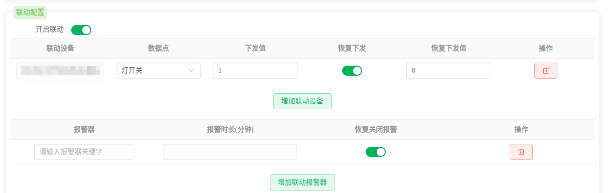

# 报警管理

在万物互联时代，数据的产生速度远超以往，操作人员借助智能设备和机器能够提升更大的生产力，同时也遇到**数据无法全面兼顾**的问题。每时每刻，系统都会产生大量的数据，有些数据是正常的，有些数据已经包含了潜在的问题，如果靠操作人员人为的判断并分许数据，人力往往是无法跟上的。因此平台亟需一种自动检测异常数据的能力，当异常数据产生时能够主动提示操作人员，从而让操作人员针对问题数据维护系统正常运行。

九星云使用**报警**的方式来实现自动检测异常数据的功能。操作人员可以根据实际情况创建一系列报警规则，当满足报警报警规则的触发条件后，触发报警，并**推送**给相应联系人（可选）以及**联动控制**其他设备或报警器（可选）。

## 触发条件

九星云控制台支持两种触发条件：**设备事件**和**数据点**。

:::tip
现实中的数据异常检测规则可能非常复杂，并且无法做到统一抽象。在这里我们考虑到现实场景的多样性，九星云控制台部分只提供了**设备事件**和**数据点**这两种最通用的触发数据源，复杂的场景可能无法实现。例如：数据对比上一次的增幅或降幅这样的判定在控制台是无法实现的。这也是行业解决方案的立足点：满足特定领域的数据处理逻辑。（在**智能测温系统**的行业解决方案中是可以实现这种报警的哦）
:::

### 设备事件

设备事件是指在设备上发生的各种状态变化或操作事件，这些事件可以是硬件层面的故障、设备的连接或断开、设备的电源开关等，也可以是软件层面的应用程序启动、关闭或崩溃、系统错误等，目前控制台支持**设备上线**与**设备离线**两种事件。

### 数据点

数据点触发是指数据点的数据上报时根据配置的报警规则进行逻辑判断。支持多个数据点按照**逻辑与**和**逻辑或**的方式组合判定。

:::tip 防抖功能介绍
由于数据在很多情况下有可能会有**抖动**的情况产生（例如：无线干扰，随机噪声等），因此如果**明确**数据可能产生抖动的情况，可以使用防抖功能过滤抖动数据，避免**误报**情况的产生。
:::

## 报警推送

当满足报警触发条件时，报警信息需要第一时间通知相关人员，九星云提供四种通知推送方式：**短信、微信、邮件和打电话**。

* **短信**：将报警内容以短信的方式推送给报警联系人。
* **微信**：将报警内容以微信消息的方式推送给报警联系人。
* **邮件**：将报警内容以E-mail邮件的方式推送给报警联系人。
* **打电话**：拨打联系人电话，语音播报报警内容。

### 推送机制

由于推送需要消耗系统资源（免费版的推送配额是有限制的），同时频繁的推送会起到信息轰炸的负面效果，为了节省资源避免信息轰炸，九星云提供两种推送机制：

1. **仅第一次推送**：设备数据上报触发报警后，由正常状态转为报警状态，只在**第一次触发**的时候，推送报警信息给用户。
2. **沉默推送**：设备处于报警状态下，在**沉默时间**内，如果再次触发报警，不推送。

### 恢复推送

当设备从报警状态下转变为正常状态时，可以下发一个推送告诉相关人员报警状态已经恢复。是否启用这个功能由用户决定。

## 联动控制

很多常见下当触发报警时会需要自动联动控制一些设备达到简单的自动运维功能。例如：在温室大棚场景下，当室内温度过高时，可能会需要启动电机，进行通风从而降低棚内温度。这个时候就可以将报警规则设置为数据点触发，内容为数据点温度的值超过x℃，联动控制选择控制电机的设备，选择开启电机即可。

### 联动恢复

和上文中的[恢复推送](#恢复推送)一样，联动控制也支持报警状态转变为正常状态时下发一个恢复指令。

### 报警器

报警器是九星自研的一款物联网声光报警器，专为报警场景使用，配合九星云可以很容易的搭建报警提示系统。