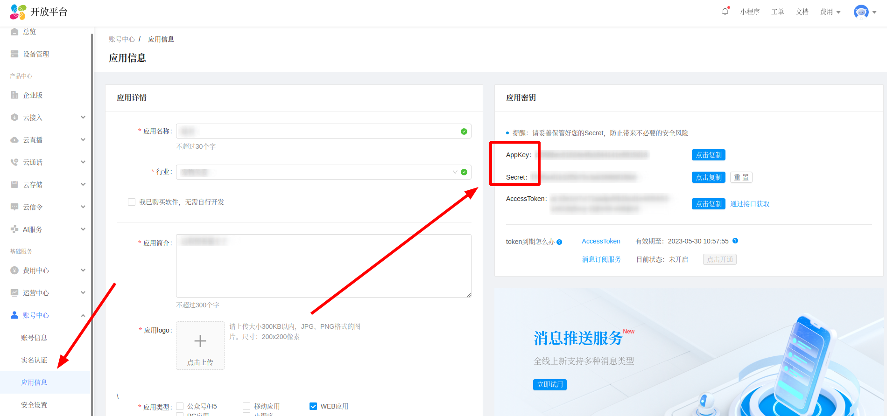
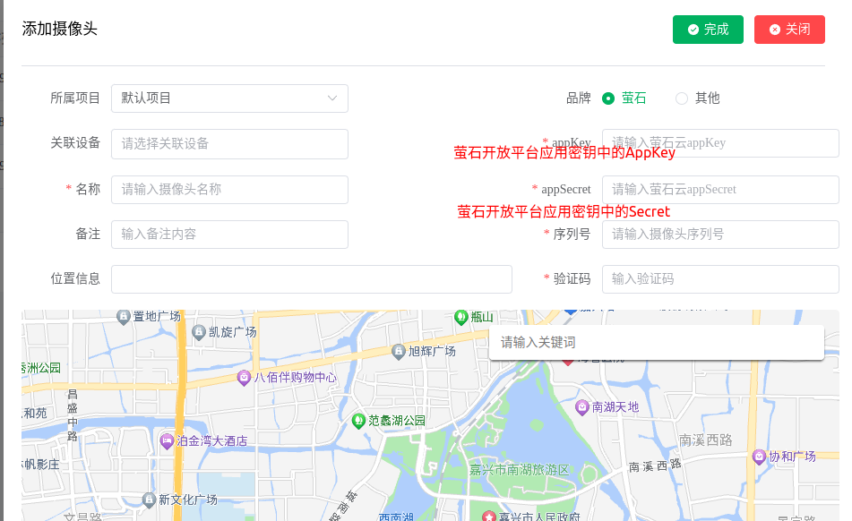
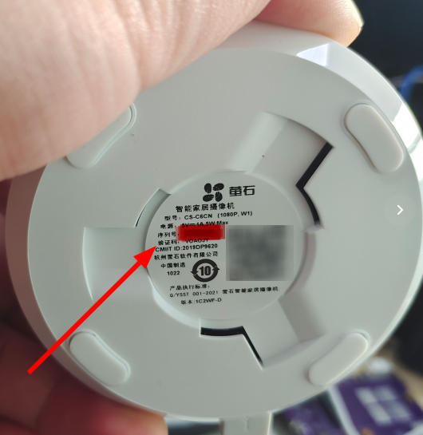

# 萤石摄像头接入

## 萤石云信息准备

萤石是海康威视旗下的一个子品牌，通常为其高端品牌。将萤石摄像头接入九星云平台需要先注册成为萤石开放平台的用户，并进行实名认证（支持个人认证和企业认证）。实名认证之后需要创建应用，创建好应用后在**控制台->账号中心->应用信息**里面查看**应用密钥**。摄像头接入九星云需要使用到应用密钥中的`AppKey`和`Secret`内容。

[萤石开发平台接入指南](https://open.ys7.com/guide.html)

## 接入九星云

在九星云控制台的摄像头管理页面点击添加按钮进行摄像头添加，默认摄像头品牌就是萤石，将萤石开放平台的`AppKey`和`Secret`填入，并填写相应的**设备序列号**和**验证码**即可。

:::caution

如果摄像头开启了**视频加密**，则**必须**填写验证码！！！否则验证码可以不填。

:::

## 附1——验证码查看

买过来的新摄像头**默认是开启视频加密**的，默认的验证码在摄像头底部黏贴的**标签**上，如下所示：

## 附2——关闭视频加密

关闭视频加密需要**手机端**（萤石云`APP`）操作，操作流程如下：

import Drawio from '@theme/Drawio'
import closeVideoEncryptGraph from '!!raw-loader!./assets/images/关闭视频加密配置.drawio';

<Drawio content={closeVideoEncryptGraph} />

## 附3——使用视频流方式接入

使用上述方式需要将萤石开放平台的`AppKey`和`Secret`上传到九星云平台，如您觉得此方式不妥（有隐私泄露隐患），可以使用视频流的方式接入。

登录萤石开放平台，进入**控制台**应用，左侧选择**设备管理**菜单，接下来点击想要接入设备的**直播地址**按钮，就可以得到`HLS`、`FLV`和`RTMP`三种格式的视频流地址了

import getVideoStreamGraph from '!!raw-loader!./assets/images/获取视频流地址.drawio';

<Drawio content={getVideoStreamGraph} />

拿到视频流地址，就可以使用视频流的方式接入了，详见文档：[其他品牌摄像头接入](../其他品牌摄像头接入/)