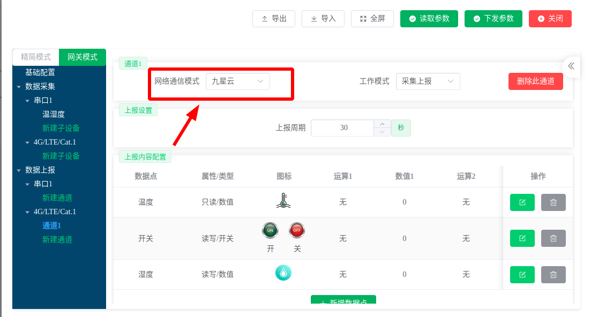
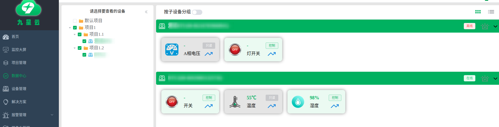
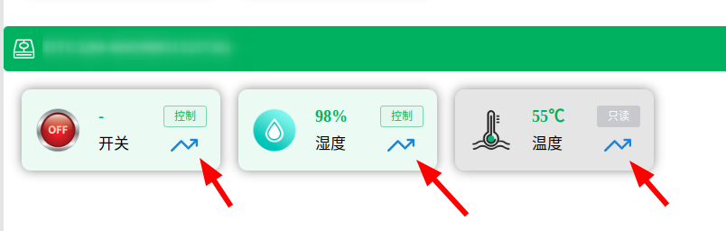
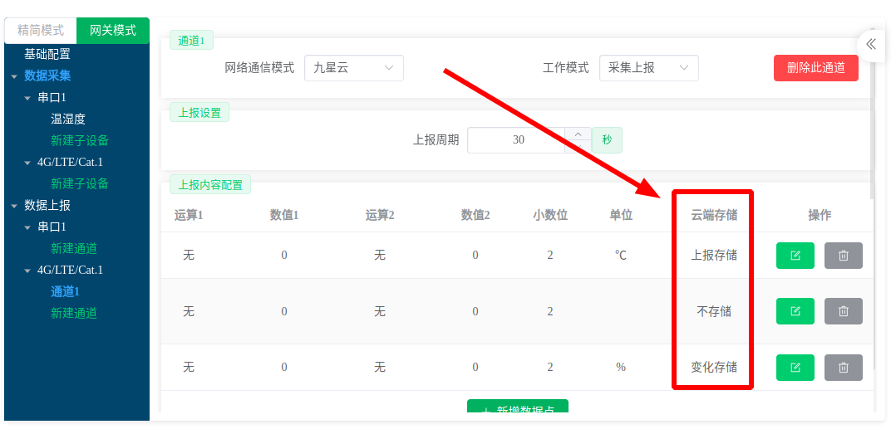

# 数据中心

数据中心提供**最简单**、**紧凑**的方式查看所有接入九星云的设备的自身参数和采集到的数据。

:::caution
设备**一定**要将数据上报给九星云才能在数据中心查看，即设备状态为**在线**而不是**配置在线**！很多用户**第一次使用**时，将设备入网并添加到云平台后发现数据中心没有设备的数据就是这个原因。

以`JX-802`型号的`DTU` (`V4`版配置协议)为例，需要在网络上报处配置一个上报通道，选择为**九星云**，如下所示：

:::

数据中心展示示例如下所示：

说明：

1. 数据点有**控制**和**只读**两种类型，控制类型的数据点可以下发并控制数据点的值。颜色区分：
   1. 控制类型：淡绿色背景。
   2. 只读类型：淡灰色背景。
2. **按子设备分组**功能开启后会将数据点按照其所在的子设备分组展示。
3. **蓝色折现图标**点击后会显示数据点的**历史数据**。

## 历史数据

九星云提供记录历史数据功能，但是需要在配置的地方选择**数据存储方式**，以`JX-802`型号的`DTU` (`V4`版配置协议)为例，如下所示：

云端存储字段拥有三个可选值，分别是：**不存储**、**上报存储**和**变化存储**。

1. **不存储**：设备上报上来的数据点数据值不会存储保留下来，在数据中心只能看到数据点的**当前值**，查看历史数据无内容。（提示：很多用户初次使用时设备明明正常上报数据了却看不到历史数据就是因为**数据存储方式配置成了不存储**）
2. **上报存储**：只要数据点上报数据，就存入历史数据中。
3. **变化存储**：当平台接收到数据点数据时，会与上一次的数据进行对比，如果发现有改变，就存入历史数据，否则不进行存储。

:::tip 为什么不直接全量存储？
物联网的数据特点是：**海量**、**大量重复**、**数据单条价值相对而言较低**。

直接全量存储会造成资源的浪费，在进行历史数据分析时会影响响应速度。采用三种策略的目的是给到用户自主权，用户根据数据的价值选择存储方式。
:::

:::caution
九星云默认给每个用户提供`2000万`条设备点历史数据的**免费额度**，在不提升额度的前提下，超出会将最早上报的历史数据清除。如需提升额度，请致电联系我们：`4001-6262-00`
:::
