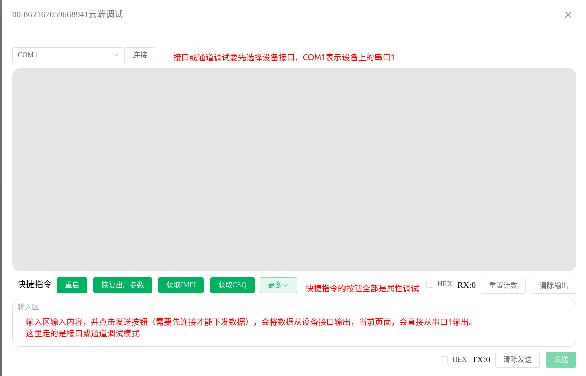

# 云端调试

在物联网行业，设备与人的关系就像徐志摩诗句中写的那样——**你若安好，便是晴天**。

通常一个人可能会管理非常多的设备，设备无法受到像我们对待手机那样的特殊“优待”，极端情况下可能从设备部署到项目生命周期终止，我们都不会去主动查看设备运行情况，只要数据OK就证明没有问题。但是一旦遇到问题，就是很头疼的问题，很多时候可能需要跑现场，无形中浪费了极大地人力物力。

基于上述痛点，九星云提供云端调试功能，只要**设备入网**（无需配置网络通道上报九星云），就可以在云端轻松调试设备啦！

:::tip
设备调试针对设备型号不同调试时提供的功能也不一样。
:::

云端调试功能支持两种调试，一种是**接口或通道**调试，一种是**属性指令**调试，详见下文。

## 接口或通道调试

该方式是用来调试**设备接口**（例如：串口、蓝牙、2.4G、LoRa等）的，该方式云端下发的数据会从设备接口发出，同时设备接口收到的数据也会发送给云端，并在网页上进行展示。

以`JX-802`型号`DTU`设备为例，将设备的**串口**与外部子设备进行连接，通讯协议使用`modbus`协议，数据流如下所示：

import Drawio from '@theme/Drawio'
import dataStreamGraph from '!!raw-loader!./assets/images/调试数据流程.drawio';

<Drawio content={dataStreamGraph} />

可以看到，平台下发的数据DTU设备会**原样**从串口输出，同时子设备回复的信息设备也会**原样**上报给平台。

## 属性指令调试

**快捷指令**下的**按钮**全部是属性指令调试，该部分功能固定，因为设备拥有哪些属性是固定的，不可自定义。
