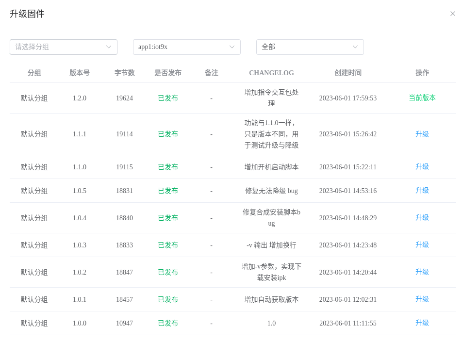

# 升级固件

在物联网行业高速发展的如今，远程升级功能使得产品拥有不断进化的功能，可以在设备的整个生命周期中优化体验、不断完善。熟悉汽车领域的用户可能听过 `OTA功能` 这个专业名词，该名词与九星云的固件升级功能是完全一样的，只不过九星云为了让用户方便理解，不增加理解的复杂度，特意使用了固件升级这样通俗易懂的名称。

:::tip
`OTA`的全称为：[空中下载技术（Over-the-Air Technology）](https://baike.baidu.com/item/%E7%A9%BA%E4%B8%AD%E4%B8%8B%E8%BD%BD%E6%8A%80%E6%9C%AF)
:::

设备只要入网，就可以在远程查看以及控制设备所运行的固件，当设备运行过程中遇到无法预测的问题时，可以通过升级固件的方式来修复问题、优化体验等。

以`JX-803`型号的`5G 工业路由器`的固件升级功能为例，升级固件页面内容如下所示：

## 多应用升级

九星系列产品拥有两种类型的固件：**单一固件**（单应用模式）和**多固件**（多应用模式）

1. **单一固件**（单应用模式）：该模式下产品只有唯一的一个应用，功能更新、优化体验等任何改动都会造成固件版本增加，类似于手机或电脑的操作系统。
2. **多固件**（多应用模式）：该模式下产品有不止一个应用。对于复杂的产品，一般是**多个小应用共同组建成一个完整的产品**。这个时候功能更新、优化体验等改动只需要升级相应的应用固件即可。可以按照如下的方式理解：
   1. **产品**——完整的手机
   2. **小应用**——手机中的各种 `APP` 软件。

例如`JX-802`型号的`DTU`是一个单一固件的产品，而上面示例中的`JX-803`型号的`5G 工业路由器`是一个多固件的产品。在使用固件升级功能时，`JX-802`型号的`DTU`只能全量升级，升级过程中必定会重启整个系统；而`JX-803`型号的`5G 工业路由器`可以选择只升级其中某一个单一应用，此时只会重启单一应用，不会重启整个系统。
