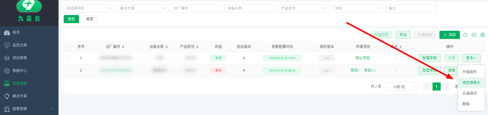
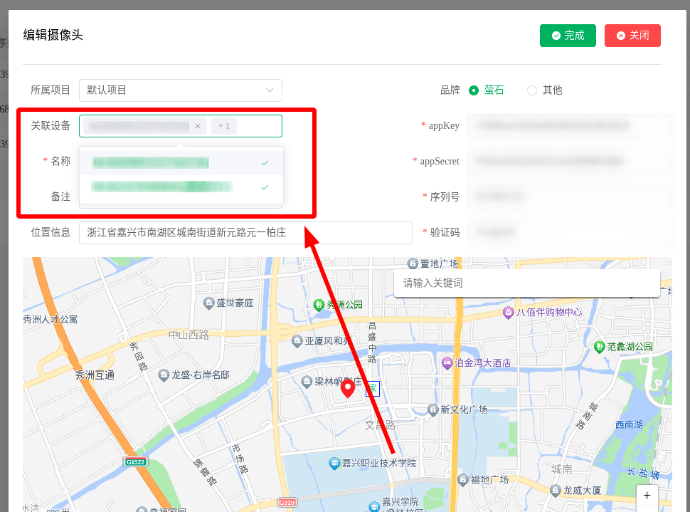
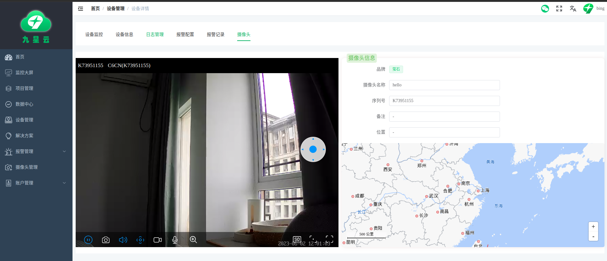

# 绑定摄像头

万物互联是社会进入数字化和信息化后的一个重要节点。在万物互联的时代，极大地解放和提高了社会生产力，一个人可以管理成百上千的设备，生产效率相较以往也是提高了几十到几百倍。相应地也会带来新时代亟待解决的问题。

**空间的割裂**是物联网行业需要着重解决的问题之一。以往传统的生产模式，一个人只能盯着自己手头的工作去做，目力所及，皆在掌握。而当下的数字化信息时代，很多场景机器人与智能设备替代了重复且繁重的人工劳作，生产力从事必躬亲的劳动中解放出来，转而变成了对机器人和智能设备的管理与维护。此时，操作人员无法实时掌控所有设备的状态，尽管将设备的各种参数指标进行了数字化展示，但是仍然无法更直观的感受现场环境。

基于上述痛点，九星云平台集成摄像头接入功能，开启上帝视角，让管理员突破空间限制，实时查看现场情况！

## 绑定方式

:::tip
一个摄像头可以绑定多个设备，但是一个设备只能绑定一个摄像头！
:::

设备绑定摄像头有两个途径：

**途径一**：在设备列表中针对单个设备进行绑定。操作路径：**设备管理**——>**设备列表**——>**更多**按钮——>**绑定摄像头**。如下所示：

**途径二**：在摄像头管理页面，当**添加**或者**编辑**摄像头信息时选择关联的设备，可以选择多个设备。如下所示：

## 预览设备绑定的摄像头

在**设备列表**中点击设备**出厂编号**或者**查看按钮**，进入**设备详情**页面，选择**摄像头**tab即可预览设备绑定的摄像头，如下所示：

:::tip
摄像头接入的协议不一样展示的效果是不一样的哦！
:::