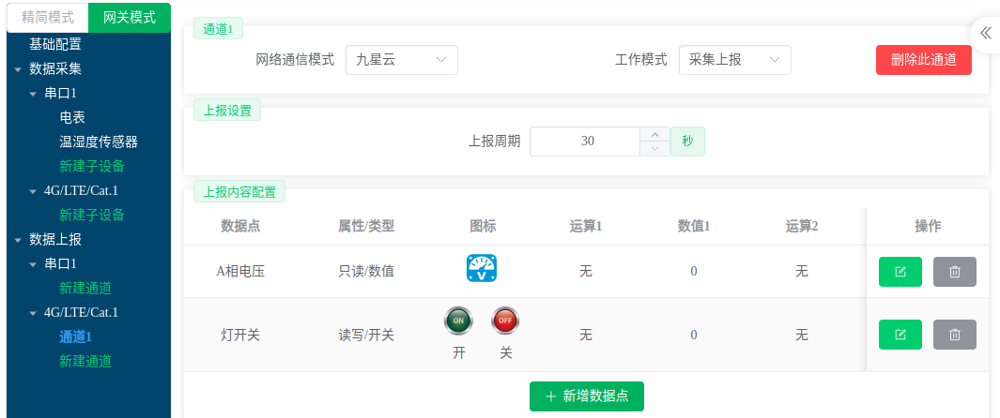

# 设备接入

目前九星云平台**仅支持九星自研设备**，**外部设备暂时不支持**（具体原因详见：[发展历程](../../发展历程/)）。设备添加到九星云平台仅需要输入设备机身标签上的**出厂编号**即可。

九星云平台提供两种模式：**基础设备管理功能**与**数据管理控制功能**。

## 基础设备管理功能

只要设备添加到九星云平台，就可以使用基础功能对设备进行管理，基础功能包括：

- [参数配置与批量参数配置](../参数配置/)
- [升级固件](../升级固件/)
- [云端调试](../云端调试/)——需要设备入网并与九星云建立连接成功（即工作在**配置在线**或**在线**状态下）

## 数据管理控制功能

使用数据管理功能，需要设备将数据上报到九星云，以`JX-802`型号`DTU`为例，**需要配置参数时在网络通道上添加一个往九星云上报的通道**，并将想要在云平台管理控制的数据点上报上去。

配置好参数后就可以使用九星云来管理、查看和控制设备数据啦！

数据管理控制相关功能有：

- [数据中心](../../数据中心/)
- [报警管理](../../报警管理/)
- [监控大屏](../../监控大屏/)